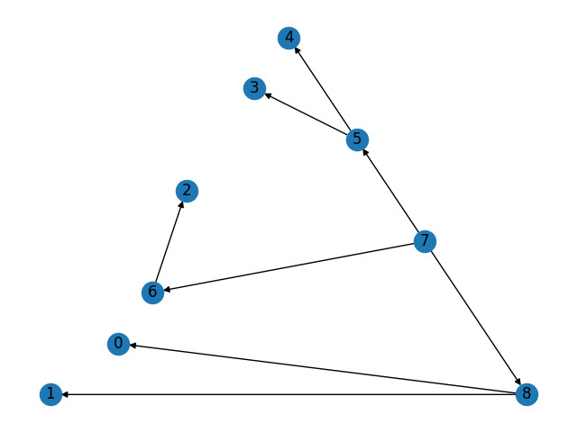

# Week 03

### Graph

### Shortest path
Shortest path between node 0 and 4 is 0, 1, 2, 3, 4.

### BFS tree from node 7

### DFS tree from node 7

### Node with the highest ranking (PageRank)
It's 5.